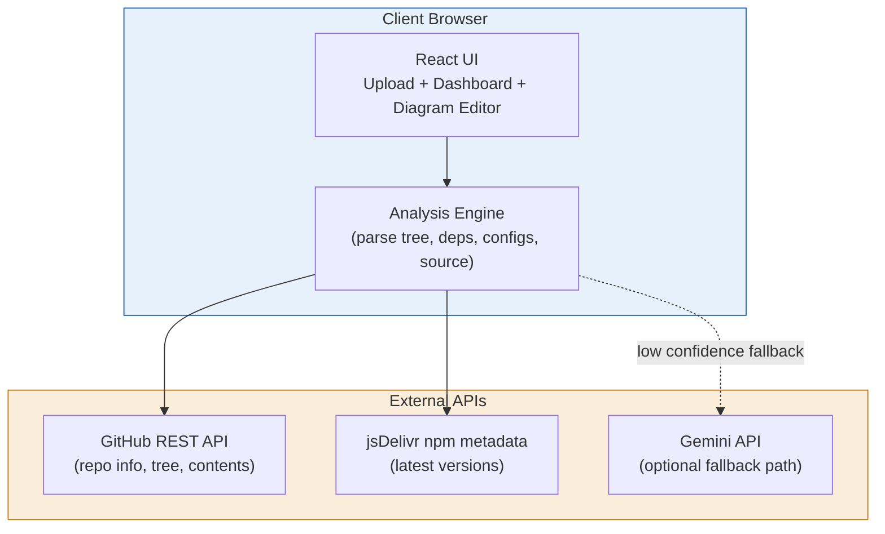
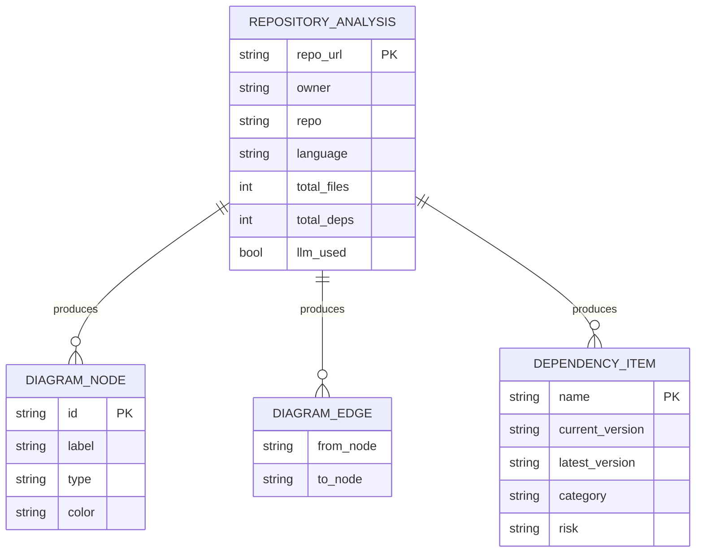
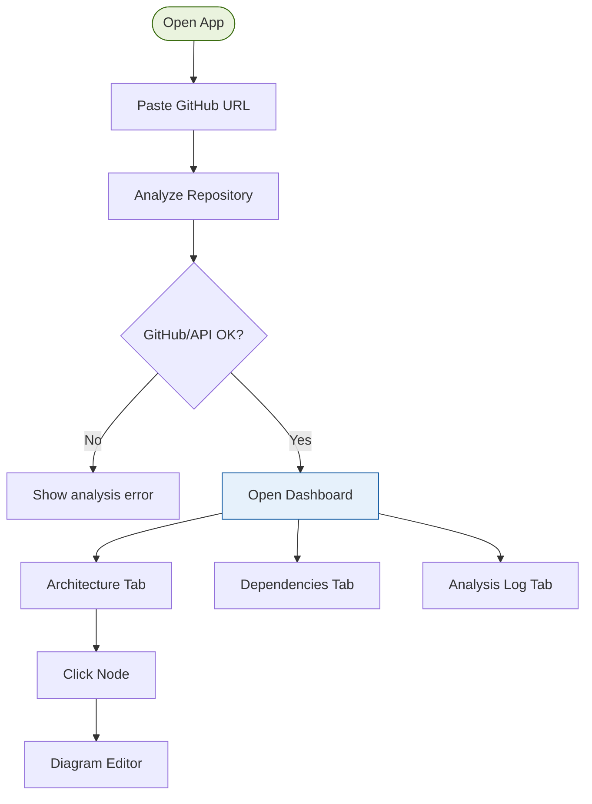
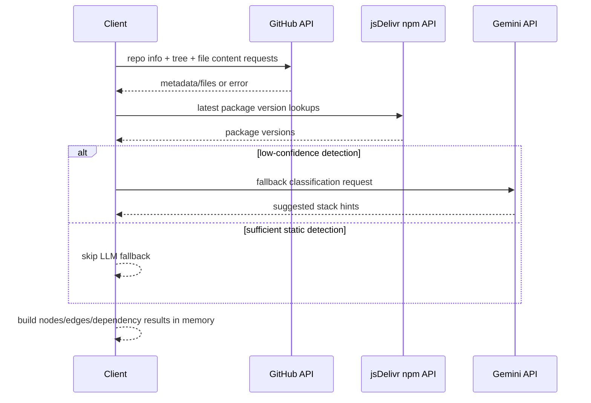

# ARCHITECTURE.md — System Architecture + Diagrams

> Structural source of truth. Describes _how_ the system is built and _why_.
> Updated whenever a significant structural decision is made.
> Diagrams live in `docs/diagrams/` and are regenerated here when structure changes.

---

## ◈ SYSTEM OVERVIEW

```
Type:         Web Application (single-page prototype)
Architecture: React SPA (client-side analysis engine in browser)
Deployment:   Local development / static frontend deployment ready
Scale target: Current: Prototype validation, single-user interactive usage
```

**System description (plain language):**
CoalesceCode currently runs as a browser-based prototype. The app analyzes public GitHub repositories directly from the client by reading repository metadata, file tree, package files, and selected source/config files. It generates architecture nodes/edges, dependency insights, and analysis logs in memory. There is no internal backend API, no database persistence, and no authentication layer in the current stage.

---

## ◈ TECH STACK

| Layer                            | Technology                      | Version         | Why this choice                                |
| -------------------------------- | ------------------------------- | --------------- | ---------------------------------------------- |
| Frontend framework               | React                           | 18.1.0          | Existing baseline, fast prototyping            |
| Language                         | JavaScript                      | ES6+            | Lower friction for rapid MVP iteration         |
| Styling                          | Inline CSS + CSS-in-JS string   | Custom          | Fast visual prototyping in one file            |
| State management                 | React useState + useRef         | React core      | No external state lib required yet             |
| Analyzer runtime                 | Browser fetch + GitHub REST API | v3 API          | Immediate value without backend infra          |
| Dependency version lookup        | jsDelivr package metadata       | public endpoint | Quick latest-version checks                    |
| Optional low-confidence fallback | Google Gemini API               | prototype-only  | Triggered only when core stack detection fails |
| Backend (internal)               | Not implemented yet             | —               | Deferred until v0.x/v1 architecture milestone  |
| Database (internal)              | Not implemented yet             | —               | Analysis results are ephemeral in memory       |
| Auth (internal)                  | Not implemented yet             | —               | Public repository analysis only                |
| Tests                            | Not implemented yet             | —               | Planned in next phase                          |

---

## ◈ SYSTEM ARCHITECTURE DIAGRAM

> Auto-generated with Mermaid. Regenerate when services or modules change.
> File: `docs/diagrams/architecture.md`



**To regenerate:** Run `/architect` and say "update architecture diagram".

---

## ◈ DATA MODEL / ERD

> Auto-generated with Mermaid `erDiagram`. Regenerate when schema changes.
> File: `docs/diagrams/erd.md`



---

## ◈ USER FLOW DIAGRAM

> Maps every path a user can take through the application.
> Auto-generated with Mermaid `flowchart`. Regenerate when user journeys change.
> File: `docs/diagrams/user-flow.md`



---

## ◈ API FLOW DIAGRAM

> Sequence diagram for the main API interactions.
> File: `docs/diagrams/api-flow.md`



---

## ◈ MODULE BREAKDOWN

### Module: App Shell + UI Navigation

```
Location:    src/App.js
Owns:        High-level screen orchestration, global app state, analysis lifecycle handlers
Depends on:  Analyzer engine + page components + local mock constants
Exposes:     Main app state and navigation behavior
```

### Module: Upload + Loading Pages

```
Location:    src/pages/UploadPage.jsx, src/pages/LoadingPage.jsx
Owns:        Upload inputs, ZIP dropzone, loading progress timeline UI
Depends on:  App handlers/state passed as props
Exposes:     Isolated page-level UI blocks for `S.UP` and `S.LOAD`
```

### Module: Dashboard + Diagram Editor Pages

```
Location:    src/pages/DashboardPage.jsx, src/pages/DiagramEditorPage.jsx
Owns:        Dashboard tab shell, diagram editor layout, tab/editor rendering surfaces
Depends on:  App-provided state/handlers + analysis result payload
Exposes:     Isolated page-level UI blocks for `S.DASH` and `S.EDIT`
```

### Module: Analysis Engine

```
Location:    src/features/analyzer/engine.mjs
Owns:        Repo/ZIP scanning, detection merge, graph building, fallback metadata, debug log
Depends on:  GitHub API, jsDelivr API, optional Gemini endpoint
Exposes:     analyzeGitHubRepo(owner, repo, onProgress, token, options)
             analyzeZipArchive(file, onProgress, options)
```

### Module: Benchmark Harness

```
Location:    scripts/run-repo-benchmark.cjs + scripts/repo-benchmark-dataset.json
Owns:        Multi-repo quality evaluation (pass/partial/fail), fallback token/cost reporting
Depends on:  Analysis engine module + GitHub API
Exposes:     pnpm benchmark:repos
```

### Module: Diagram Views

```
Location:    src/pages/DashboardPage.jsx + src/pages/DiagramEditorPage.jsx
Owns:        SVG rendering, node interactions, simulated refactor actions
Depends on:  nodes/edges dataset from analysis or mock fallback
Exposes:     Interactive architecture and editor surfaces
```

---

## ◈ DATA MODEL (detailed)

> Full schema. Business entities and relationships.
> Migration files are the deployment source of truth — this is for understanding.

Current state: no internal database schema exists yet.

All analysis data is computed client-side and kept in React state only.

Planned persistence schema (users/projects/analysis snapshots) will be documented when backend work starts.

---

## ◈ API CONTRACTS

Current state: no internal API routes are implemented.

External contracts used directly from browser:

```
GET /repos/{owner}/{repo}
GET /repos/{owner}/{repo}/git/trees/{branch}?recursive=1
GET /repos/{owner}/{repo}/contents/{path}?ref={branch}
GET https://cdn.jsdelivr.net/npm/{package}/package.json
POST https://generativelanguage.googleapis.com/v1beta/models/{model}:generateContent (fallback path, prototype)
```

---

## ◈ AUTH & AUTHORIZATION

```
Mechanism:   None in v0.0.1-alpha prototype
Access:      Public repository analysis only
Sessions:    Not applicable
Roles:       Not implemented
```

---

## ◈ ERROR HANDLING STRATEGY

```
Layer           Approach
─────────────────────────────────────────────────────
UI              Inline validation and explicit user-facing error messages
                Loading/progress state per analysis stage
                Avoid silent failures; keep analysis log visible

Analyzer         Wrap network/parsing steps and continue where possible
Engine           Return partial output with debug warnings when feasible

External APIs    Handle GitHub/http status errors clearly (rate-limit/private/404)
                 Fallback latest version to current when npm metadata is unavailable
                 Skip optional LLM fallback if unavailable; keep static detection result
```

---

## ◈ INFRASTRUCTURE & DEPLOYMENT

```
Production:
    Frontend:   Not deployed in production yet
    Backend:    Not implemented
    Database:   Not implemented
    CDN:        N/A at this stage

Staging:      Local-only development validation

CI/CD:
    Trigger:    Not configured yet
    Steps:      Planned for v0.x hardening
    Approvals:  N/A
```

---

## ◈ KNOWN ARCHITECTURAL CONSTRAINTS

```
1. Analyzer runs entirely in browser — simpler prototype, but limited by CORS/rate limits — add backend proxy in next phase.
2. No persistence layer — fastest iteration, but no history/projects — add database + user model after architecture lock.
3. Global state and handlers remain centralized in a large `src/App.js` shell — continue feature-level extraction under `src/pages` and `src/features/*`.
```

---

## ◈ DIAGRAM GENERATION GUIDE

> How to regenerate diagrams when the system changes.

All diagrams use Mermaid syntax. They can be:

- Previewed directly in VS Code with the "Markdown Preview Mermaid Support" extension
- Rendered on GitHub (GitHub natively renders Mermaid in markdown)
- Exported as PNG/SVG via `mmdc` CLI: `npx -p @mermaid-js/mermaid-cli mmdc -i diagram.md -o diagram.svg`

When the agent updates a diagram, it:

1. Updates the Mermaid block in this file
2. Updates the corresponding file in `docs/diagrams/`
3. Verifies the syntax renders correctly (no unclosed brackets, valid node IDs)
4. Notes the update in SESSION_LOG.md

---

## ◈ CHANGE LOG

| Date       | What changed                                                                            | Why                                                                 | ADR reference |
| ---------- | --------------------------------------------------------------------------------------- | ------------------------------------------------------------------- | ------------- |
| 2026-03-29 | Added deterministic inventory heuristics + extracted upload/loading page components     | Increase benchmark pass rate and start UI modularization safely     | ADR-004       |
| 2026-03-29 | Extracted analysis engine to dedicated module and added benchmark harness               | Remove duplicate logic and validate detection quality on real repos | ADR-003       |
| 2026-03-29 | Reframed architecture to actual client-side prototype, updated diagrams and constraints | Documentation described future architecture as already implemented  | ADR-002       |
| 2026-03-28 | Initial tech stack baseline documented                                                  | Project initialization, baseline before MVP                         | ADR-001       |
