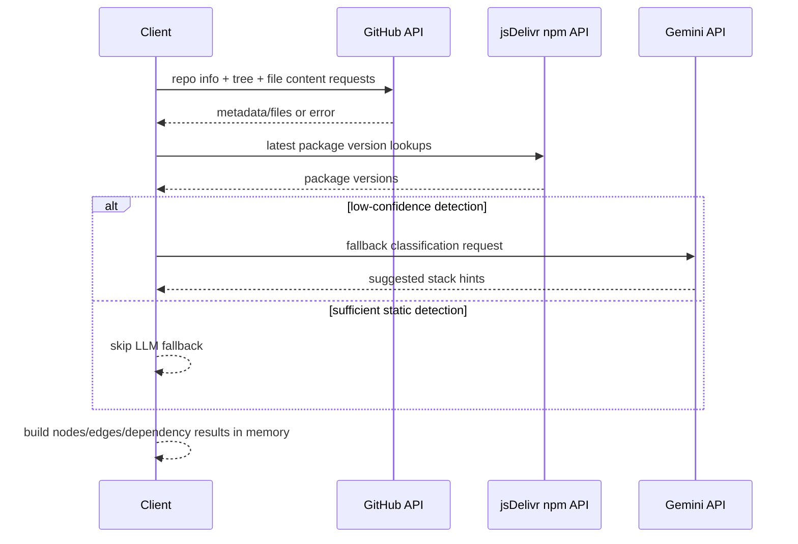

# API Flow (Current State)

```mermaid
sequenceDiagram
    participant C as Client
    participant GH as GitHub API
    participant NPM as jsDelivr npm API
    participant LLM as Gemini API

    C->>GH: repo info + tree + file content requests
    GH-->>C: metadata/files or error
    C->>NPM: latest package version lookups
    NPM-->>C: package versions

    alt low-confidence detection
        C->>LLM: fallback classification request
        LLM-->>C: suggested stack hints
    else sufficient static detection
        C-->>C: skip LLM fallback
    end

    C-->>C: build nodes/edges/dependency results in memory
```
