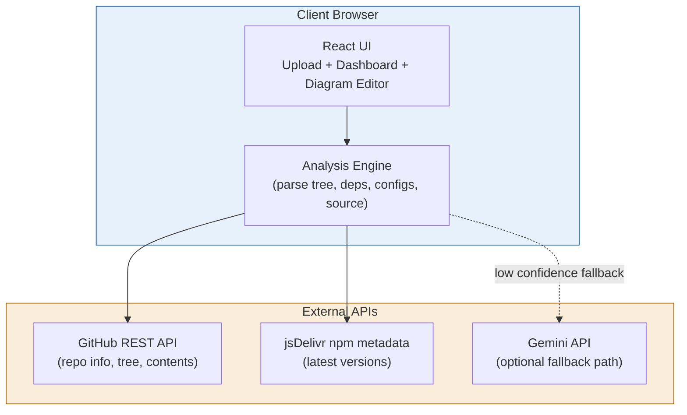

# Architecture Diagram (Current State)

```mermaid
graph TB
    subgraph Browser["Client Browser"]
        UI["React UI\nUpload + Dashboard + Diagram Editor"]
        Engine["Analysis Engine\n(parse tree, deps, configs, source)"]
    end

    subgraph External["External APIs"]
        GH["GitHub REST API\n(repo info, tree, contents)"]
        NPMMeta["jsDelivr npm metadata\n(latest versions)"]
        LLM["Gemini API\n(optional fallback path)"]
    end

    UI --> Engine
    Engine --> GH
    Engine --> NPMMeta
    Engine -. low confidence fallback .-> LLM

    style Browser fill:#E6F1FB,stroke:#185FA5
    style External fill:#FAEEDA,stroke:#BA7517
```
