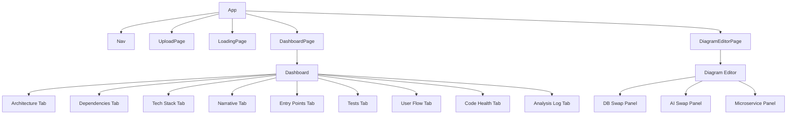

# Component Tree (Current State)

```mermaid
graph TD
    App[App]
    App --> Nav[Nav]
    App --> UploadPage[UploadPage]
    App --> LoadingPage[LoadingPage]
    App --> DashboardPage[DashboardPage]
    App --> DiagramEditorPage[DiagramEditorPage]

    DashboardPage --> Dashboard[Dashboard]
    DiagramEditorPage --> DiagramEditor[Diagram Editor]

    Dashboard --> ArchitectureTab[Architecture Tab]
    Dashboard --> DependenciesTab[Dependencies Tab]
    Dashboard --> TechStackTab[Tech Stack Tab]
    Dashboard --> NarrativeTab[Narrative Tab]
    Dashboard --> EntryPointsTab[Entry Points Tab]
    Dashboard --> TestsTab[Tests Tab]
    Dashboard --> UserFlowTab[User Flow Tab]
    Dashboard --> CodeHealthTab[Code Health Tab]
    Dashboard --> AnalysisLogTab[Analysis Log Tab]

    DiagramEditor --> DbSwapPanel[DB Swap Panel]
    DiagramEditor --> AiSwapPanel[AI Swap Panel]
    DiagramEditor --> MicroservicePanel[Microservice Panel]
```
