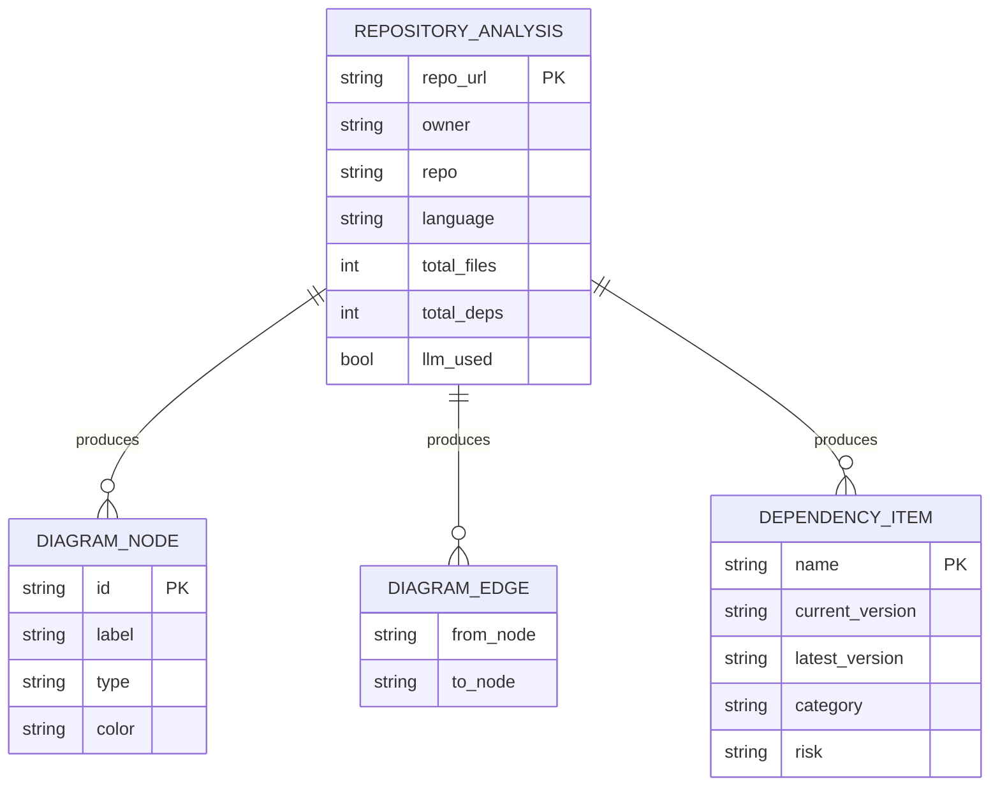

# ERD (Current State)

Note: There is no persistent database yet. The model below represents in-memory analysis objects.

```mermaid
erDiagram
    REPOSITORY_ANALYSIS {
        string repo_url PK
        string owner
        string repo
        string language
        int total_files
        int total_deps
        bool llm_used
    }

    DIAGRAM_NODE {
        string id PK
        string label
        string type
        string color
    }

    DIAGRAM_EDGE {
        string from_node
        string to_node
    }

    DEPENDENCY_ITEM {
        string name PK
        string current_version
        string latest_version
        string category
        string risk
    }

    REPOSITORY_ANALYSIS ||--o{ DIAGRAM_NODE : "produces"
    REPOSITORY_ANALYSIS ||--o{ DIAGRAM_EDGE : "produces"
    REPOSITORY_ANALYSIS ||--o{ DEPENDENCY_ITEM : "produces"
```
