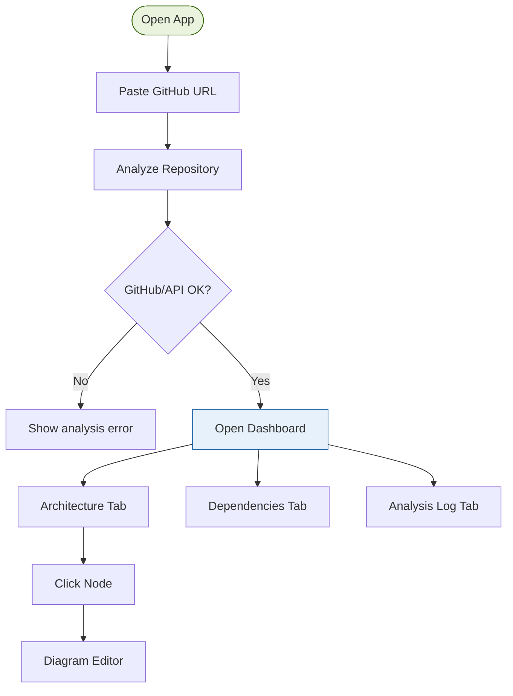

# User Flow (Current State)

```mermaid
flowchart TD
    Start([Open App]) --> PasteURL[Paste GitHub URL]
    PasteURL --> Analyze[Analyze Repository]
    Analyze --> APICheck{GitHub/API OK?}
    APICheck -->|No| Error[Show analysis error]
    APICheck -->|Yes| Dashboard[Open Dashboard]

    Dashboard --> ArchTab[Architecture Tab]
    Dashboard --> DepTab[Dependencies Tab]
    Dashboard --> LogTab[Analysis Log Tab]
    ArchTab --> ClickNode[Click Node]
    ClickNode --> Editor[Diagram Editor]

    style Start fill:#EAF3DE,stroke:#3B6D11
    style Dashboard fill:#E6F1FB,stroke:#185FA5
```
